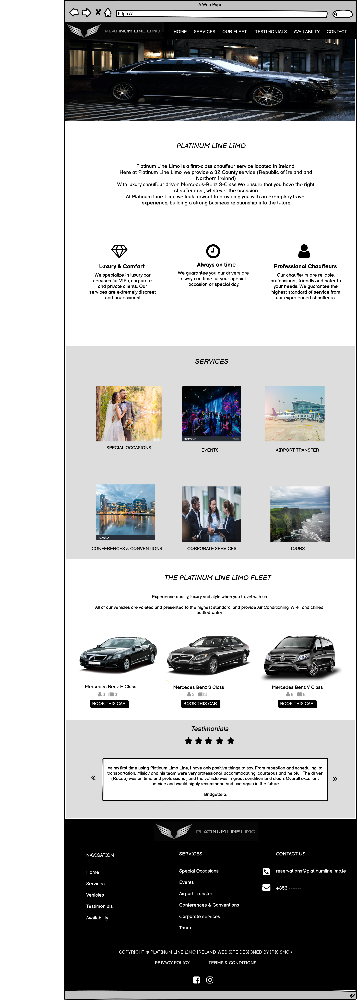
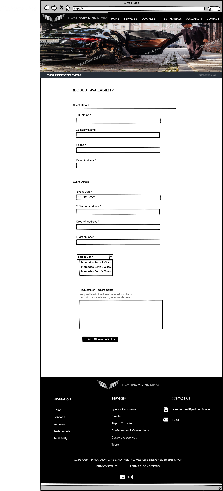
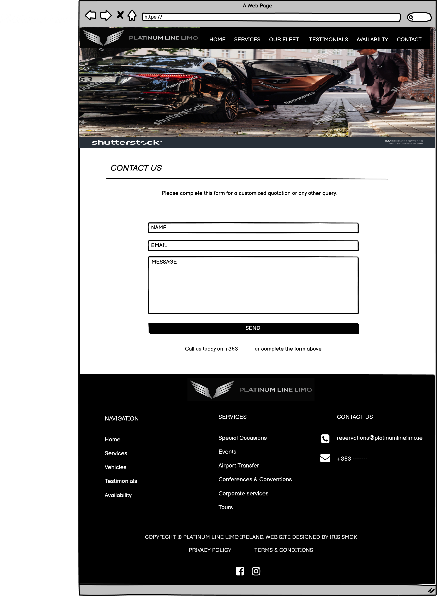
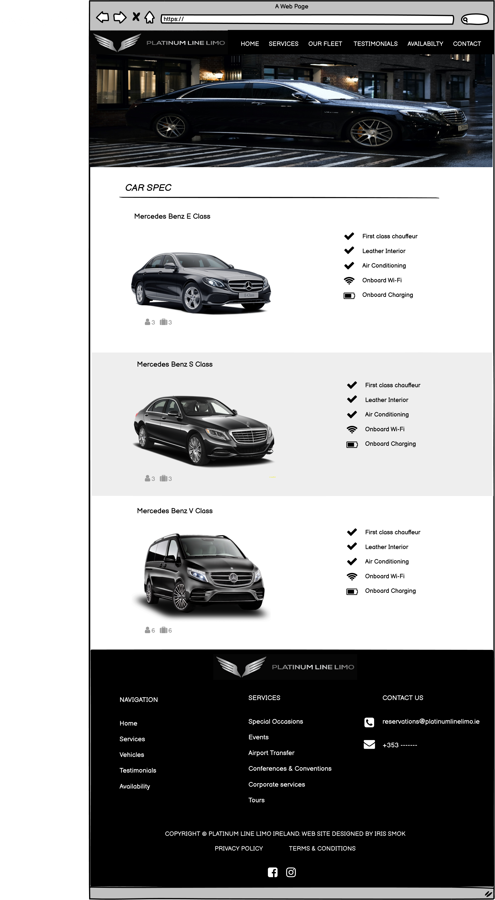
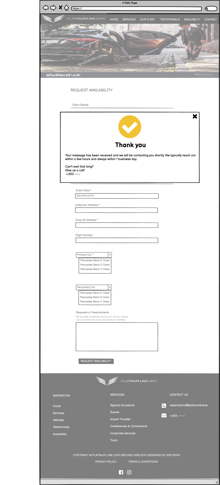

# About
This is a static site project built using HTML, CSS, JS & Bootstrap. I created a website for 'Platinum Line Limo' which is designed to sell private transport services. 
I started this site as a single page website, but during planning I decided to make separate pages for contact forums and car specification. This enables easy navigation and a better overview of the site itself.

# User Stories

- As a user I can see an interesting home page so that I can understand what kind of services Platinum Line Limo provides
- As a user I can easily navigate through the site so that I can view desired content
- As a user I can easily find a navigation bar and footer so that I can see what content there is on the website
- Aa a user I can easily see the vehicles list so that I can see what kind of transport vehicles the Platinum Line Limo has to offer
- As a user, I can see how many people and suitcases a certain car can accommodate
- As a user I can see vehicles specification so that I can easily see what every vehicles has to offer
- As a user I can see reviews so that I can see the experience of other client
- As a user I can quickly and easy find the services you provide
- As a user I can read Privacy Policy
- As a user I can read Terms & Conditions
- As a user  I can contact the Platinum Line Limo so that I can find out any information that I require
- As a user I can check vehicle availability so that I can make sure a certain car is available on requested date and time
- As a user I will get a confirmation message when submit contact and availabiliy form

# Features

- An easy and simple navigation throught the website
- List of services that Platinum Line Limo provides
- List of vehicles that Platinum Line Limo has to offer
- Car specifications for each vehicles so that user can see what each vehicle has to offer
- Easily visible testimonials of other clients
- Contact form so that clients can easily get in touch if they have certain requirements and questions
- Availability form so that clients can book desired vehicle
- Thank you message when user submits the form so that the user can be sure the form has been submitted
- Easily visible Platinum Line Limo contact infromation
- Social links in the footer of each page so user can follow the Platinum Line Limo via social networks and be up to date with the latest information

# Structure

## Navbar

- Logo positioned left, navigation bar on the right
- Appers on every page so users can esily navigate throught the site

## Footer

- Appears on every page with a navigation links,services, contact information and social links
- navigation links only appear on large screens

## Home Page

- Image - appears at the top of the page, located below the navbar section,
- Platinum Line Limo - located below the image, allows users to get more informations about the Platinum Line Limo
- Features - located below introduction section, allows users to see what kind of features Platinum Line Limo has to offer
- Services - located below features section, allows users to see list of services Platinum Line Limo has to offer
- The Platinum Line Limo Fleet - allows users to see list of vehicles the Platinum Line Limo has to offer, they also can see  how many people and suitcases a certain vehicle can accommodate
- Car specification - when the user clicks on the desired car in the Fleet section, the link takes them to the car specification page
- Testimonials - allow potential client to see the reviews from current/previous clients, which will help them trust the services offered by the Platinum Line Limo

## Availability 
- Contains form where user can request desired vehicle

## Contact 
- Contains contact form so that clients can easily get in touch if they have certain requirements and questions

# Wireframes

## Home Page

## Home Page - Mobile 

## Availability

## Contact 

## Car Spec

## Thank You Note

